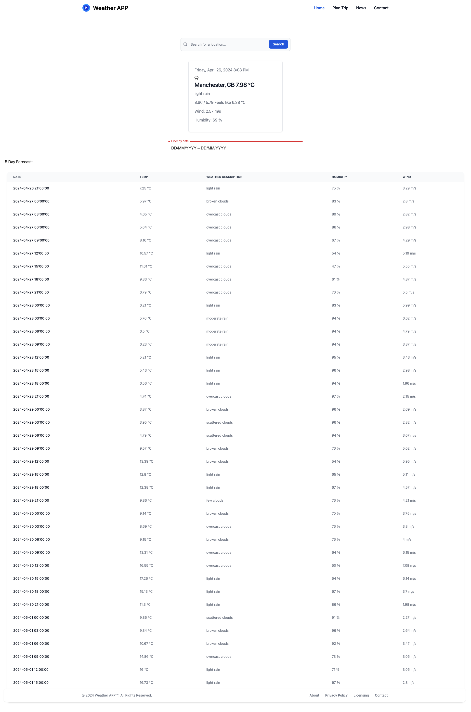

# React Weather App
The weather APP is an application developed on [ReactJS](https://react.dev/) using [Vite](https://vitejs.dev/guide/) build tool. This is a Frontend Web Application that makes request to the [OpenWeather API](https://openweathermap.org/api) to get Current Weather Data and 5 Day / 3 Hour Forecast data.

## Functionality
The Weather application has a search function where a user can enter a location from anywhere in the world and this location is used to make an [Axios](https://axios-http.com/docs/intro) call to the OpenWeather API endpoints for [Current Weather data](https://openweathermap.org/current) and [5 day weather forecast](https://openweathermap.org/forecast5). The weather data returned are then presented dynamically on the screen.

## Tech Stack
The tech stack used in the front-end development are:

* [ReactJS](https://react.dev/)
* [Axios js](https://axios-http.com/docs/intro)
* [Vite](https://vitejs.dev/guide/)
* [React Router Dom](https://reactrouter.com/en/main)
* [Tailwind CSS](https://tailwindui.com/documentation)
* [Material UI](https://mui.com/material-ui/getting-started/)
* [Day.js](https://day.js.org/en/)
* [Flowbite CSS](https://flowbite.com/docs/getting-started/quickstart/)

## Mock Up
The following image shows the web application's appearance and functionality:

## Deployment
The application is deployed at the following link - [Weather APP]()